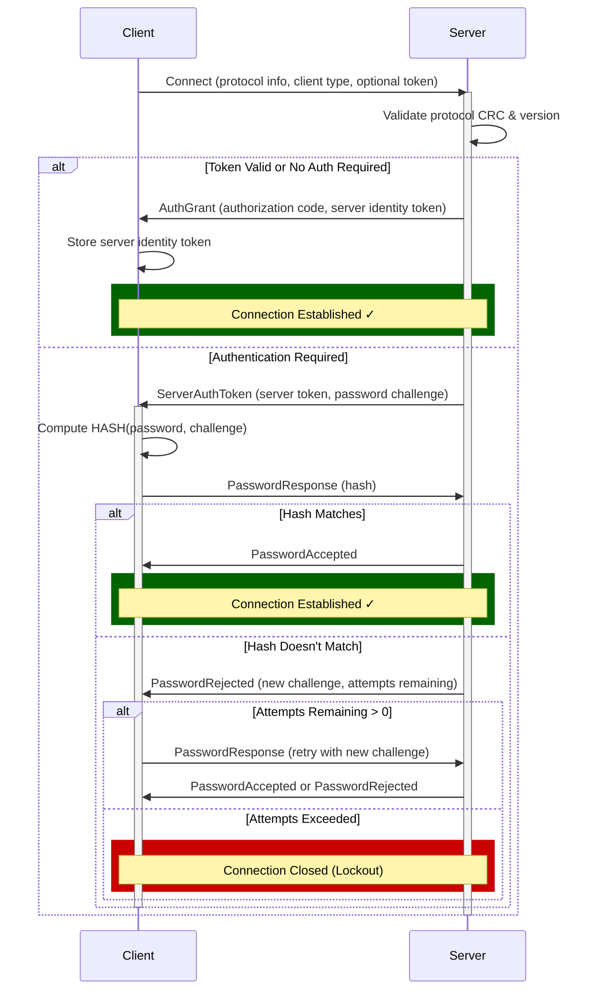
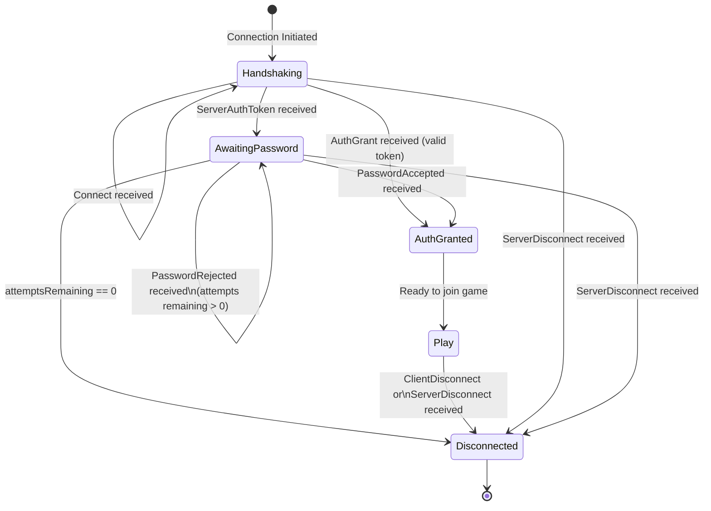

# Definitions

The Hytale server accepts connections from UDP clients using the QUIC protocol. The server and clients exchange messages using *packets*. A packet is a structured unit of data that contains information such as the sender, recipient, and the message payload.

The meaning of a packet depends both on its packet ID and the current state of the connection. The connection can be in one of several states, such as "handshaking", "play", or "status".

## Data Types

All data sent over the network is a [big-endian](https://en.wikipedia.org/wiki/Endianness) byte order. This means that multi-byte values are transmitted with the most significant byte first. For example, the 32-bit integer value `0x12345678` would be sent as the byte sequence `0x12 0x34 0x56 0x78`.

| Name | Size (Bytes) | Encodes | Notes |
|------|--------------|---------|-------|
| [Boolean](#) | 1 | False or True | True is encoded as `0x01`, and False is encoded as `0x00`. |
| Byte | 1 | An integer between -128 and 127 | Signed 8-bit integer, [two's complement](https://en.wikipedia.org/wiki/Two%27s_complement) format. |
| Unsigned Byte | 1 | An integer between 0 and 255 | Unsigned 8-bit integer. |
| Short | 2 | An integer between -32,768 and 32,767 | Signed 16-bit integer, [two's complement](https://en.wikipedia.org/wiki/Two%27s_complement) format. |
| Unsigned Short | 2 | An integer between 0 and 65,535 | Unsigned 16-bit integer. |
| Int | 4 | An integer between -2,147,483,648 and 2,147,483,647 | Signed 32-bit integer, [two's complement](https://en.wikipedia.org/wiki/Two%27s_complement) format. |
| Unsigned Int | 4 | An integer between 0 and 4,294,967,295 | Unsigned 32-bit integer. |
| Long | 8 | An integer between -9,223,372,036,854,775,808 and 9,223,372,036,854,775,807 | Signed 64-bit integer, [two's complement](https://en.wikipedia.org/wiki/Two%27s_complement) format. |
| Float | 4 | A floating-point number | 32-bit IEEE 754 floating-point format. |
| Double | 8 | A double-precision floating-point number | 64-bit IEEE 754 floating-point format. |
| String (n) | >= 1 \n \< n*3 + 3 | A sequence of Unicode Scalar values | UTF-8 String prefixed with its size in bytes as a VarInt. Maxium length of `n` characters, which varies by context. The encoding used on the wire is regular UTF-8, not Java's "slight modification". However, the length of the string for purposes of length limit is its number of UTF-16 code units, that is, scalar values > U+FFFF are counted as two. Up to `nx 3` bytes can be used to encode a UTF-8 string comprising `n` code units when converted to UTF-16, and both of those limts are checked. Maxium n value is 32767. The +3 is due to the max size of a valid length VarInt |

# Handshaking

The handshaking process is a multi-phase authentication and validation protocol that establishes secure connections between clients and the server. It supports both token-based and password-based authentication.

## Handshake Flow Diagram

## Initial Connection

### `Connect` Packet (ID: 0x00)

**Direction:** Client → Server 

| Packet ID | Bound To | Field Name | Field Type | Size | Notes |
|-----------|----------|-----------|-----------|------|-------|
| 0x00 | Serverbound | protocolCRC | Int | 4 bytes | CRC integrity check of the protocol definition |
| 0x00 | Serverbound | protocolBuildNumber | Int | 4 bytes | Protocol version number for compatibility checking |
| 0x00 | Serverbound | clientVersion | String (20) | 20 bytes (fixed) | Client application version (e.g., "1.0.0") |
| 0x00 | Serverbound | clientType | Byte | 1 byte | Client type: `Game` (0) or `Editor` (1) |
| 0x00 | Serverbound | identityToken | String | variable | Authentication token from previous session if available |
| 0x00 | Serverbound | language | String (16) | variable (max 16 chars) | Client language preference (RFC 5646 format) |
| 0x00 | Serverbound | referralData | byte[] | variable (max 4096 bytes) | Information about how client was referred |
| 0x00 | Serverbound | referralSource | HostAddress | variable | Network address of referral source |

## Server Authentication Decision

After validating the `Connect` packet, the server makes one of two decisions:

### Direct Access

#### `AuthGrant` Packet (ID: 0x0B)

**Direction:** Server → Client

If the client has a valid existing session token or the server doesn't require authentication, the server grants immediate access.

| Packet ID | Bound To | Field Name | Field Type | Size | Notes |
|-----------|----------|-----------|-----------|------|-------|
| 0x0B | Clientbound | authorizationGrant | String | variable (max 4096 chars) | OAuth/authorization code for the client |
| 0x0B | Clientbound | serverIdentityToken | String | variable (max 8192 chars) | Long-lived token identifying this server session. **Important:** Clients should cache this token for future reconnections |

### Password Challenge Required

#### `ServerAuthToken` Packet (ID: 0x0D)

**Direction:** Server → Client

If the server doesn't recognize the client or password verification is required:

| Packet ID | Bound To | Field Name | Field Type | Size | Notes |
|-----------|----------|-----------|-----------|------|-------|
| 0x0D | Clientbound | serverAccessToken | String | variable (max 8192 chars) | Server-specific access token for this session |
| 0x0D | Clientbound | passwordChallenge | byte[] | 1-64 bytes | Cryptographic challenge data (salt/nonce) for password verification |

The `passwordChallenge` is a random nonce that the client must use in conjunction with the user's password to compute a response hash.

#### `ConnectAccept` Packet (ID: 0x0E)

**Direction:** Server → Client

| Packet ID | Bound To | Field Name | Field Type | Size | Notes |
|-----------|----------|-----------|-----------|------|-------|
| 0x0E | Clientbound | passwordChallenge | byte[] | 1-64 bytes | Cryptographic challenge bytes for the client to respond to |

---

## Phase 3: Password Response

### `PasswordResponse` Packet (ID: 0x0F)

**Direction:** Client → Server

The client responds to the password challenge with a computed hash:

| Packet ID | Bound To | Field Name | Field Type | Size | Notes |
|-----------|----------|-----------|-----------|------|-------|
| 0x0F | Serverbound | hash | byte[] | 1-64 bytes | Client-computed hash response: `HASH(password + challenge)`. The hash algorithm and salt strategy is server-defined |

## Authentication Result

### `PasswordAccepted` Packet (ID: 0x10)

**Direction:** Server → Client | **State:** Handshaking

Empty packet signaling successful password authentication. 

### `PasswordRejected` Packet (ID: 0x11)

**Direction:** Server → Client | **State:** Handshaking

| Packet ID | Bound To | Field Name | Field Type | Size | Notes |
|-----------|----------|-----------|-----------|------|-------|
| 0x11 | Clientbound | newChallenge | byte[] | 1-64 bytes | New challenge for retry attempt |
| 0x11 | Clientbound | attemptsRemaining | Int | 4 bytes | Number of login attempts before lockout. When `0`, connection should be terminated |

## Disconnection

Either the client or server can initiate disconnection at any time:

### `ClientDisconnect` Packet (ID: 0x01)

**Direction:** Client → Server

| Packet ID | Bound To | Field Name | Field Type | Size | Notes |
|-----------|----------|-----------|-----------|------|-------|
| 0x01 | Serverbound | reason | FormattedMessage | variable | Human-readable disconnect reason |
| 0x01 | Serverbound | type | Byte | 1 byte | Disconnect type: `Normal` (0) or `Crash` (1) |

### `ServerDisconnect` Packet (ID: 0x02)

**Direction:** Server → Client

| Packet ID | Bound To | Field Name | Field Type | Size | Notes |
|-----------|----------|-----------|-----------|------|-------|
| 0x02 | Clientbound | reason | FormattedMessage | variable | Human-readable disconnect reason |
| 0x02 | Clientbound | type | Byte | 1 byte | Disconnect type: `Normal` (0) or `Crash` (1) |

## Handshake State Machine

